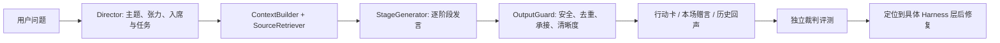

# v0.5 Harness 质量评测与迭代记录

## 目标

验证「她们会怎么想？」不是一次性角色生成，而是能被检查和迭代的多角色对话产品。评测由生成模型完成整场圆桌，独立裁判模型从九个维度评分：读题、人物区分、谈话推进、重复控制、贴题、语言、安全、行动卡、金句卡。

固定题集覆盖副业选择、关系边界、家庭期待、自我价值、表达困境、原因不明的低落感、已命名情绪，以及用户纠正误读。

## Harness



关键取舍：

- 不一次性生成整篇“圆桌报告”，而是开场、逐人发言、讨论、追问、收束分别生成。
- 不强制温和交锋；Director 可选择递进、澄清、互补或跳过。
- 历史回声来自核验过的 curated 资料库；模型不凭记忆现场编名言。
- 行动卡沿一条主线展开，赠言绑定同一位先行者的本场真实发言。

## 基线与修复

基线全量运行：`2026-07-20T17-16-11-630Z`，平均 `85`，MVP `4/8`，无 fallback、无硬性失败。

| 发现 | 定位 | 修复 |
| --- | --- | --- |
| 金句卡退回普通格言或直接摘录正文 | `StageGenerator.finalize` | 赠言优先由本场 source message 生成；复制或失效时重写，最后才以该人物的本场新增判断作语义压缩 |
| 行动型发言突然跳到建议 | `assignedTurnIssues` / repair prompt | 检查是否承接前文；触发修复时要求先完成该人物自己的判断、再给一个动作 |
| `newContribution` 比正文更丰富 | `assignedTurnIssues` | 检查新增判断是否实际出现在正文中，并在修复 prompt 中要求元数据只能概括已说出的内容 |
| 原因未知时角色说成同一种“先观察” | Director + 角色任务分配 | 记录为下一轮优先事项：需要把观察对象、判断条件和人物姿态拆得更开 |

定点回归显示上述修复能改善对应故障，但不能把单次抽样当成稳定性结论：

| 场景 | 基线 | 修复后定点回归 |
| --- | ---: | ---: |
| 自我价值与比较 | 74，未通过 | 89，通过；金句卡 92，无硬性问题 |
| 表达与可见性 | 84，未通过 | 85，通过 |
| 原因不明的低落感 | 87，金句卡未过 | 89，通过 |
| 用户纠正误读 | 86，金句卡未过 | 84，通过（另一次随机回归为 83，未过） |

## 全量结果

修复后的全量运行：`2026-07-20T20-33-31-354Z`。

- 平均分：`85`
- MVP：`4/8`
- 高质量目标：`0/8`
- fallback：`0`
- 硬性安全失败：`0`

通过：副业与职业选择 `88`、关系边界 `86`、表达与可见性 `85`、用户纠正误读 `84`。

全量均分和基线持平，说明当前修复解决了被定位的局部故障，但尚未把多角色质量稳定到可重复的高质量水平。这是一个应保留在作品集中的结论，而不是应被隐藏的数字。

## 下一轮优先级

1. **正文与元数据一致性**：将 `newContribution` 变为可验证的正文锚点，而非仅依赖相似度阈值。
2. **人物分工更细**：在 `unknown_cause` 场景把“观察”拆成感受描述、外部干扰、行动负荷、互动变化等互斥任务。
3. **行动卡来源最小集**：只引用实际采用的主线和一条风险依据，避免“引用了但没有用到”。
4. **稳定性评测**：每题至少重复 3 次，报告均值、方差和关键硬性失败率，而非用单次运行代表模型能力。

## 复现

```bash
npm run check:harness
npm run eval -- --case self-worth-comparison
npm run eval -- --full
```

原始运行结果位于本地 `eval-results/<run-id>/report.md`；该目录不提交，避免将大量模型输出和用户问题样本纳入仓库历史。
