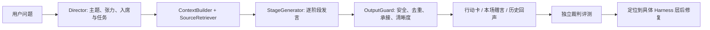

# v0.5 Harness 质量评测与迭代记录

## 目标

验证「她们会怎么想？」不是一次性角色生成，而是能被检查和迭代的多角色对话产品。评测由生成模型完成整场圆桌，独立裁判模型从九个维度评分：读题、人物区分、谈话推进、重复控制、贴题、语言、安全、行动卡、金句卡。

固定题集覆盖副业选择、关系边界、家庭期待、自我价值、表达困境、原因不明的低落感、已命名情绪，以及用户纠正误读。

## Harness



关键取舍：

- 不一次性生成整篇“圆桌报告”，而是开场、逐人发言、讨论、追问、收束分别生成。
- 不强制温和交锋；Director 可选择递进、澄清、互补或跳过。
- 历史回声来自核验过的 curated 资料库；模型不凭记忆现场编名言。
- 行动卡沿一条主线展开，赠言绑定同一位先行者的本场真实发言。

## 基线

基线全量运行：`2026-07-20T17-16-11-630Z`，平均 `85`，MVP `4/8`，无 fallback、无硬性失败。裁判模型为 GLM-5.2（火山方舟部署 `glm-5-2-260617`）。

## 定位到的系统性问题与修复

基线报告暴露三类系统性问题，逐条定位到具体 Harness 层：

| 问题 | 定位 | 修复 |
| --- | --- | --- |
| 金句卡脱离本场：退回通用格言，或不同人物退回同一句兜底（如 probe-heavy 场景伍尔夫与奥斯汀赠言一字不差） | `renderClosingCard` / `sourceDerivedClosingQuote` / `matchHistoricalEcho` | 兜底提炼优先从该人物**自己**的本场贡献重新压缩（天然区分）；通用格言仅作最后 fallback；新增 `dedupeClosingQuotes` 跨卡去重，撞车时改用该人物唯一的收束语；历史回声要求 ≥1 个具体标签命中，宽泛标签不再单独触发 |
| 行动型发言直接跳到建议，不承接前文 | `assignedTurnIssues` / repair prompt | 对 `offer_one_step` 增加软校验 `actionAcknowledgesContext`：先承接或推进前文的具体判断，再给动作；不足时触发 repair 重试；不做机械复述要求 |
| 感受承认型（`name_emotion`）复述主持人读题分析 | `pioneerSpeech` / `assignedTurnIssues` | 把读题摘要（tension/emotion/need）传入发言生成与校验；`name_emotion` 除与其他人物比对外，也检测与 ThemeAnalysis 文本的重合；人物差异靠语气、观察角度、承接方式和下一步体现 |

在这一版基础上又发现并修复了一个由上述改动间接放大的回归：

| 问题 | 定位 | 修复 |
| --- | --- | --- |
| 同一人物在 first_round 与 follow_up 两轮都掉进确定性兜底 → 两轮发言**逐字完全相同**（relationship-boundary 场景奥斯汀，导致该题从 89 掉到 73） | `hasHardTurnIssue` / `followUp` 兜底路径 | ① 把新加的 `contributionIsVisibleInContent`（正文与元数据相似度 0.18）从**硬失败降为软失败**——它仍触发 repair，但即使未修好也保留真实模型输出，不再丢进兜底；② 新增 `dedupeFollowUpFallback`：follow_up 兜底若与本人前一轮高度相似，改用一句真正承接追问的替代内容 |

问题根因诊断依据：给评测运行器临时加日志，打印 `pioneerSpeech`/`followUp` 中静默的 `usedGuardRepair` 与 `guardIssues`（这些字段原本不落盘）。实测确认奥斯汀掉兜底的直接原因是 `contributionIsVisibleInContent` 被判硬失败，而非最初推测的“开场概念重复”。诊断日志在提交前已移除。

## 脱离裁判的结构性验证

以下验证不依赖裁判分数，可复现：

- **无逐字复读**：扫描最终全量运行的全部 8 份 prepared JSON，任一人物在同一场内没有两条 `content` 完全相同。上一轮 73 分的根因（奥斯汀两轮一字不差）消除。
- **guard-repair 降软生效**：`"正文没有落实 deliveredContribution"` 在运行日志中标记为 `[GUARD-SOFT]` 而非 `[GUARD-FALLBACK]`，即保留了模型真实输出。
- `npm run check:harness` 与 `npx tsc --noEmit` 通过。

## 裁判模型迁移（重要：影响可比性）

基线与前几轮对比使用火山方舟的 `glm-5-2-260617`。该账号免费额度耗尽后（返回 `429 SetLimitExceeded`），裁判迁移到**智谱官网**的 `glm-5.2`（`https://open.bigmodel.cn/api/paas/v4`）。

- 两者是**同一模型家族（GLM-5.2）**，但一个是带日期快照的火山部署、一个是智谱官方端点，是否解析到同一份权重无法确认。
- 因此：**跨裁判的绝对通过数与分数不能直接比较**。基线的 `4/8` 在火山尺子上，下方修复后全量的 `3/8` 在智谱尺子上，二者不是同一把尺子量出的。
- 该评测本身有已观测到的真实方差：relationship-boundary 在几乎相同条件下曾走出 89 → 73 → 88 的波动（约 ±15 分）。单次运行的通过数应视为一个样本，而非稳态。

## 全量结果（智谱裁判，修复版）

运行：`2026-07-21T09-45-44-932Z`，裁判 `glm-5.2`（智谱官网）。

- 平均分：`84`
- MVP：`3/8`（career-side-hustle、relationship-boundary、named-emotion-shame）
- 高质量目标：`0/8`

| 场景 | 结果 | 备注 |
| --- | ---: | --- |
| career-side-hustle | 86 通过 | |
| relationship-boundary | 88 通过 | 上一轮 73 的逐字复读已修复 |
| named-emotion-shame | 86 通过 | |
| family-expectations | 86 未通过 | 某核心维度低于门槛 |
| self-worth-comparison | 84 未通过 | 落在方差区间 |
| probe-heavy-mornings | 85 未通过 | 金句仍受 unknown_cause 确定性兜底限制 |
| expression-visibility | 75 未通过 | 李清照/伍尔夫意象趋同、假交锋（既有人物同质化问题，非本轮改动所致） |
| correction-recovery | 85 未通过 | 本轮生成阶段 discussion 随机降级（DeepSeek fallback，未改动该路径） |

这是一个应保留在作品集中的诚实结论：三个交办问题与 73 分回归已在代码层修复并通过结构性验证；但把多角色质量稳定到可重复的高质量水平，仍是尚未达成的目标，且评测尺子的迁移让本轮绝对分数无法与基线直接对齐。

## 同尺 before/after 对比（智谱裁判，单样本）

为恢复可比性，用基线代码（提交 `fde7885`）在**同一把智谱 `glm-5.2` 尺子**下重跑了一次全量（运行 `2026-07-21T12-46-22-356Z`），与修复版（`c2b084e`，运行 `2026-07-21T09-45-44-932Z`）逐题对齐：

| 场景 | 基线 `fde7885` | 修复 `c2b084e` |
| --- | ---: | ---: |
| career-side-hustle | 85 通过 | 86 通过 |
| relationship-boundary | 85 通过 | 88 通过 |
| family-expectations | 88 通过 | 86 未通过 |
| self-worth-comparison | 86 通过 | 84 未通过 |
| expression-visibility | 85 通过 | 75 未通过 |
| probe-heavy-mornings | 84 未通过 | 85 未通过 |
| named-emotion-shame | 85 通过 | 86 通过 |
| correction-recovery | 86 通过 | 85 未通过 |
| **平均 / MVP 通过** | **86 / 7-8** | **84 / 3-8** |

**这组数据不构成质量结论，必须谨慎解读**：

- **2 分的平均差（86 vs 84）落在噪声内**。生成端 DeepSeek 每场温度 0.25–0.55、内容非确定，裁判端 GLM-5.2 实测 ±15 分方差。两次跑的是「两副不同的牌 + 会飘的裁判」，2 分差既不能证明变差、也不能证明变好。
- **通过数 7 vs 3 的落差主要是门槛抖动**：修复版多个场景总分 84–86 却「未通过」，是单个核心维度跌破 75 线，而非总分崩塌；基线那次恰好都压在线上。这正是「单样本 + ±15 方差，过线数不稳」的表现。
- **唯一像信号、且方向支持修复的地方**：基线版 probe-heavy 的**金句卡仅 72 分**，裁判原话「赠言整体偏万能化，遮住名字后班昭与李清照的赠言互换也成立」——这正是金句去重 fix 要治的病。但这也只是一个数据点，不足以归因于 fix。

**结论**：本轮 fix 的效果尺寸（几分级）小于裁判的噪声底（±15），裁判分这把尺子量不出它。这不是 fix 无效，而是**仪器精度不匹配**。因此 fix 是否生效，应由下节的确定性断言判定，裁判分只作「有没有整体塌陷」的粗门槛。

## 评测方法：两轨判定

单次裁判分对「定点、机械」的改动不是可靠信号，本项目改用两轨：

- **第一轨 · 确定性断言（证明 fix 生效，零方差）**。每个定点 fix 配一条布尔判定，不受裁判情绪影响，纳入 `npm run check:harness`：
  - 金句去重 → 同场任意两位先行者的赠言不逐字/近似雷同（撞车时改用该人物唯一收束语）；
  - 承接校验 → `offer_one_step` 发言必须先承接或推进前文判断，纯给动作会被 `actionAcknowledgesContext` 判否；
  - guard 降级 → `contributionIsVisibleInContent` 从硬失败降为软失败，不再把真实模型输出丢进兜底；
  - follow-up 去重 → `dedupeFollowUpFallback` 保证追问轮兜底不与本人前一轮逐字雷同。
- **第二轨 · 裁判分作粗门槛（防崩塌，不测精度）**。总分 ≥82 是「有没有哪里塌了」的哨兵，只看多次运行的趋势与中位数，**不据单次 2 分波动下结论**。

这套取舍本身是评测认知的一部分：当改动的效果尺寸小于裁判噪声底时，用确定性断言证明改动、把 LLM 裁判降级为粗门槛，比反复刷分或迷信单次分差更可靠。

## 已知边界与下一轮优先级

1. **冻结 golden transcripts**：把某次基线的 prepared 转写钉死成 fixture，冻结生成端随机；比较质量时对同一批转写反复判 N 次取中位数，把裁判方差也压下去。这是让 baseline 从「一个会飘的数」变回「一条可复现基线」的下一步。
2. **稳定性评测**：每题至少重复 3 次，报告均值、方差和硬性失败率，而非用单次运行代表模型能力。
3. **人物同质化**：expression-visibility 暴露的李清照/伍尔夫意象趋同、假交锋，是比金句兜底更深的结构问题，需要在 Director 任务分配层拉开人物姿态。
4. **unknown_cause 金句天花板**：该模式下卡片整段走确定性兜底以守安全边界，金句只能从元数据派生，无法真正“从本场发言提炼”。若要提升，需让金句走模型生成并保留 `findUnknownCauseIssues` 安全兜底——是有安全回归风险的改动，未在本轮实施。
5. **正文与元数据一致性**：将 `newContribution` 变为可验证的正文锚点，而非仅依赖相似度阈值。

## 复现

```bash
npm run check:harness
npm run eval -- --case self-worth-comparison
npm run eval -- --full
```

裁判模型通过 `.env.local` 的 `EVAL_API_KEY` / `EVAL_BASE_URL` / `EVAL_JUDGE_MODEL` 配置；切换裁判端点会改变判分尺子，跨尺子结果不可直接比较。原始运行结果位于本地 `eval-results/<run-id>/report.md`；该目录不提交，避免将大量模型输出和用户问题样本纳入仓库历史。
